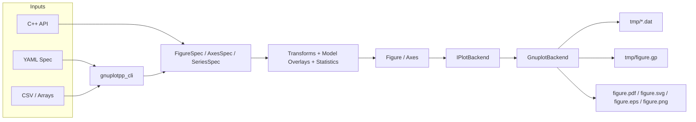
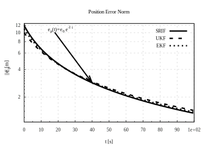
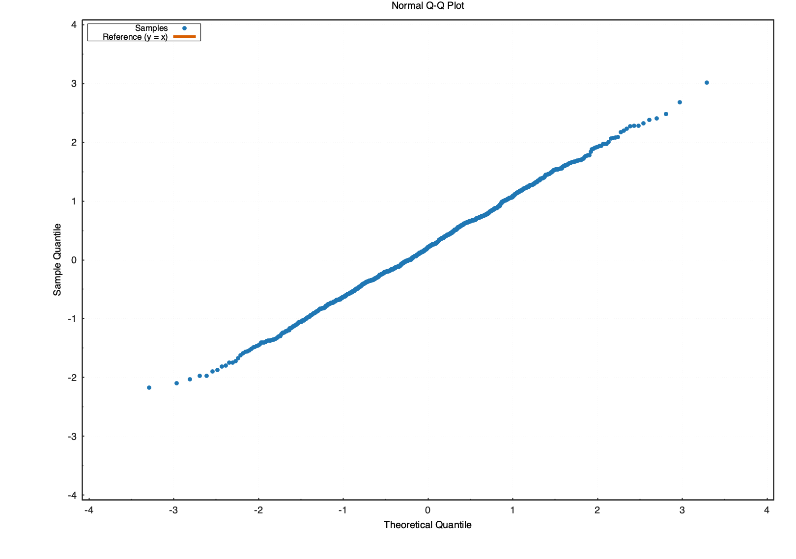
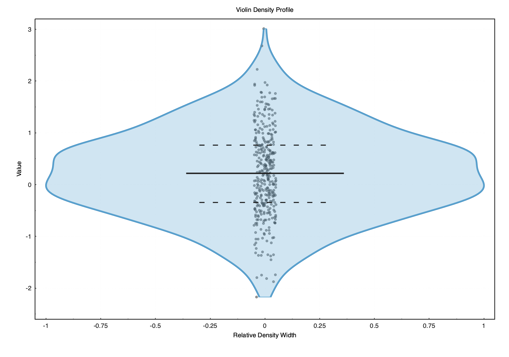
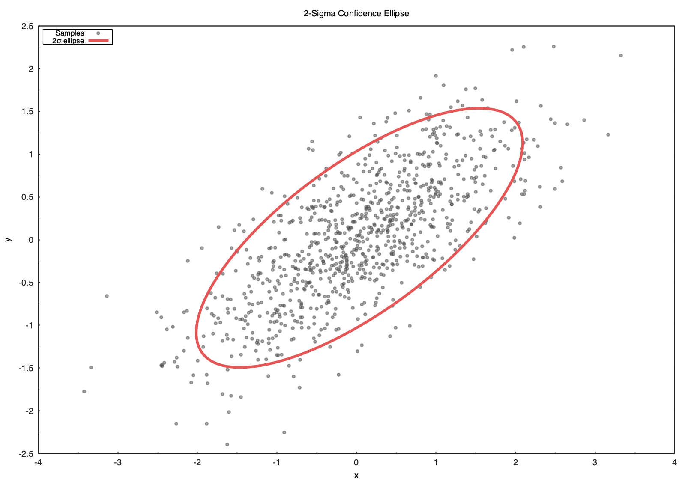
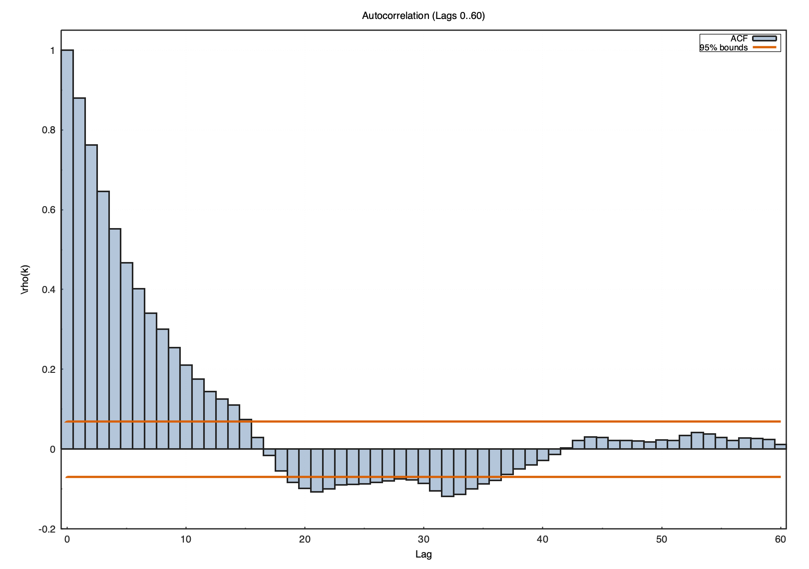
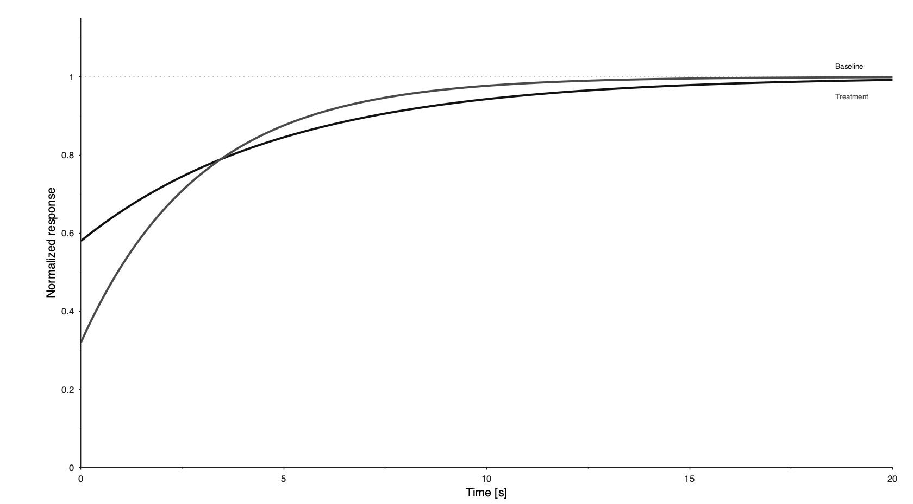
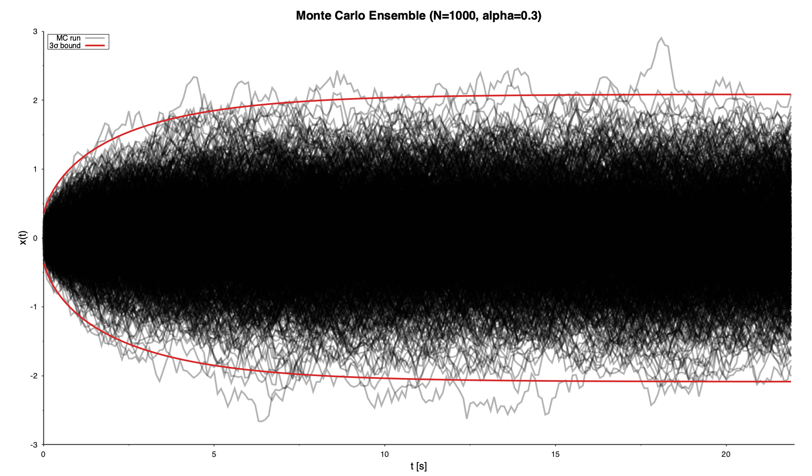

# gnuplotpp

Pure C++20 plotting API with a gnuplot renderer for figures.

## New Capability Set

- Palette/color-cycle API (`Default`, `Tab10`, `Viridis`, `Grayscale`)
- Secondary-axis (`y2`) series support
- Shared-axis layout controls for multi-panel figures
- Interactive preview script generation (`interactive_preview`)
- Panel labels + figure caption metadata (`panel_labels`, `caption`)
- Confidence bands (`add_band`)
- Histogram, KDE, ECDF, percentile-band, and heatmap helpers
- Fan-chart and violin uncertainty helpers
- QQ plot, box summary, and confidence ellipse helpers
- Rich legend controls (position, columns, box, opacity, font)
- Tick/format controls (major step, minor count, format strings)
- Text mode selection (`Enhanced`, `Plain`, `LaTeX` toggle)
- Journal-like presets (`IEEE_Tran`, `Nature_1Col`, `Elsevier_1Col`)
- Style profiles (`Science`, `IEEE_Strict`, `AIAA_Strict`, `Presentation`, `DarkPrintSafe`, `Tufte_Minimal`)
- Typed annotations/objects (labels, arrows, rectangles)
- Typed equation/callout annotations (`equations`, `callouts`)
- Fluent `FigureBuilder` API
- Quick-start helpers (`make_quick_figure_spec`, `make_quick_figure`, `make_quick_axes`)
- One-shot publication helper (`make_publication_figure`)
- Theme JSON save/load (`save_theme_json` / `load_theme_json`)
- Data transforms (`moving_average`, `downsample_uniform`, `autocorrelation`)
- Transform pipeline (`TransformPipeline`, z-score/clip/rolling)
- Statistical model overlays (`linear_fit`, `add_linear_fit_overlay`)
- CSV ingestion and unit-aware labels (`read_csv_numeric`, `label_with_unit`)
- Faceting helpers (`facet_grid`, `apply_facet_axes`)
- Composition helpers (`apply_panel_titles`, `apply_shared_legend`, `apply_shared_colorbar_label`)
- Auto legend placement heuristic (`auto_place_legend`)
- YAML declarative spec loading (`load_yaml_figure_spec`)
- Template gallery and quick templates (`apply_plot_template`, `write_template_gallery_yaml`)
- DataTable column plotting adapters (`add_line`, `add_scatter`)
- Versioned theme presets (`ThemePreset::*_v1`)
- CLI renderer (`gnuplotpp_cli --spec ... --out ...`)
- Font fallback chain for cross-format typography consistency
- Reproducibility manifest export (`manifest.json`)

## Requirements

- CMake >= 3.20
- C++20 compiler
- `gnuplot` (required for final figure generation)
- `yaml-cpp` (required for YAML spec loading)

Install `gnuplot`:

```bash
# macOS
brew install gnuplot

# Ubuntu/Debian
sudo apt-get update && sudo apt-get install -y gnuplot libyaml-cpp-dev

# Fedora
sudo dnf install -y gnuplot yaml-cpp-devel
```

## Build

```bash
cmake --preset dev-debug
cmake --build --preset build-debug
ctest --preset test-debug
```

## Documentation

- [Documentation Index](docs/README.md)
- [API Contracts](docs/API_CONTRACTS.md)
- [Getting Started](docs/GETTING_STARTED.md)
- [Best Practices Quick Reference](docs/BEST_PRACTICES.md)
- [Styling and Presets](docs/STYLING_AND_PRESETS.md)
- [Statistical Plot Guide](docs/STATISTICS_GUIDE.md)
- [Examples Cookbook](docs/EXAMPLES.md)
- [Troubleshooting](docs/TROUBLESHOOTING.md)
- [Full Plot Controls](docs/PLOT_CONTROLS.md)

Refresh all README figure assets from current examples:

```bash
cmake --build --preset build-debug --target refresh-readme-assets
# or:
./scripts/refresh_readme_assets.sh
```

## Architecture



## Publication Workflow

1. Configure a publication preset (`IEEE_SingleColumn`, `IEEE_DoubleColumn`, `AIAA_Column`, `AIAA_Page`).
2. Set output formats to vector (`Pdf`, `Svg`, optional `Eps`).
3. Render via `GnuplotBackend` from your C++ executable.
4. Use PDF as primary submission asset.

## Publication Defaults in Renderer

- Cairo terminals with enhanced text
- Explicit line widths and rounded joins
- Tick formatting and outward tics
- Grid styling suitable for print
- Escaped plot labels/titles for robust script generation

### Strict IEEE Mode

When using `IEEE_SingleColumn` or `IEEE_DoubleColumn`, renderer behavior is tightened to print-safe defaults:

- 8.5 pt Times-style text defaults
- monochrome plotting by default (`set monochrome`)
- dashed line-style differentiation per series (`dt 1..N`)
- per-series color/opacity overrides disable global monochrome automatically
- SciencePlots-like axis defaults: visible minor ticks, thin 0.5 axis/grid strokes
- vector-first outputs (`PDF`, `SVG`, `EPS`)

## Examples

```bash
./build/dev-debug/two_window_example --out out/two_window
./build/dev-debug/layout_2x2_example --out out/layout_2x2
./build/dev-debug/three_line_ieee_example --out out/three_line_ieee
./build/dev-debug/monte_carlo_alpha_example --out out/monte_carlo_alpha
./build/dev-debug/feature_rich_showcase --out out/feature_rich_showcase
./build/dev-debug/interactive_facet_example --out out/interactive_facet_example
./build/dev-debug/yaml_spec_example --out out/yaml_spec_example
./build/dev-debug/gnuplotpp_cli --spec examples/specs/minimal.yaml --out out/cli_run
./build/dev-debug/stats_plot_examples --out out/stats_plot_examples
./build/dev-debug/tufte_minimal_example --out out/tufte_minimal_example
```

### Annotated IEEE Example

Generated from:

```bash
./build/dev-debug/three_line_ieee_example --out out/three_line_ieee_readme
```



### Statistical Plot Gallery

Generated from:

```bash
./build/dev-debug/stats_plot_examples --out out/stats_plot_examples
```

Normal Q-Q:



Violin with raw samples:



Confidence ellipse:



Autocorrelation:



### Tufte Minimal Example

Generated from:

```bash
./build/dev-debug/tufte_minimal_example --out out/tufte_minimal_example
```

Direct labels, minimal framing, and low-ink reference guides:



### Monte Carlo Ensemble (+/-3 Sigma)

Generated from:

```bash
./build/dev-debug/monte_carlo_alpha_example --out out/monte_carlo_alpha_example --npaths 1000 --lw 2 --alpha 0.3
```



Expected outputs:

- `out/<name>/figures/figure.pdf`
- `out/<name>/figures/figure.svg`
- `out/<name>/figures/figure.eps`
- `out/<name>/figures/tmp/figure.gp`
- `out/<name>/figures/tmp/ax*_series*.dat`

Detailed controls and recipes: [Plot Controls](docs/PLOT_CONTROLS.md)

## Error Handling

`RenderResult.status` values:
- `Success`
- `InvalidInput`
- `IoError`
- `ExternalToolMissing`
- `ExternalToolFailure`
- `UnsupportedFormat`
