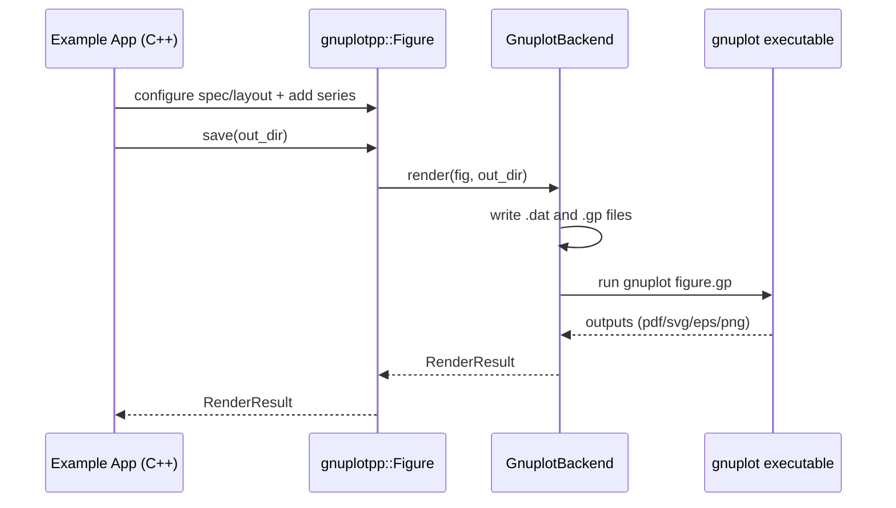

# gnuplotpp

Pure C++20 plotting API with a gnuplot backend for publication-ready IEEE/AIAA figures.

## Build

```bash
cmake --preset dev-debug
cmake --build --preset build-debug
ctest --preset test-debug
```

## Architecture

```mermaid
flowchart LR
  A[FigureSpec/AxesSpec/SeriesSpec] --> B[Figure/Axes Containers]
  B --> C[IPlotBackend]
  C --> D[GnuplotBackend]
  D --> E[tmp/*.dat]
  D --> F[tmp/figure.gp]
  D --> G[figure.pdf|svg|eps|png]
```

## Render Flow



## CMake Presets

- `dev-debug`
- `dev-release`
- `dev-cpm`
- `build-debug`
- `build-release`
- `build-cpm`
- `test-debug`
- `test-release`

## CPM Dependencies (inside CMake)

CPM is optional via `GNUPLOTPP_ENABLE_CPM=ON`.
When enabled, CMake downloads `CPM.cmake` and resolves C++ libraries (currently `nlohmann_json`).

## Gnuplot and CPM

Short answer: not directly in a reliable cross-platform way.

- CPM is best for CMake/C++ package dependencies.
- `gnuplot` here is an external CLI renderer, not a typical CMake target dependency.
- Recommended: install `gnuplot` with system package managers (`brew`, `apt`, `dnf`, etc.) and keep CPM for C++ libs.
- You can still point the backend to a custom executable path with `make_gnuplot_backend("/path/to/gnuplot")`.

## Example Plots

```bash
./build/dev-debug/two_window_example --out out/two_window
./build/dev-debug/layout_2x2_example --out out/layout_2x2
```

Outputs are always generated for inspection:

- `out/<name>/figures/tmp/*.dat`
- `out/<name>/figures/tmp/figure.gp`

Rendered outputs require installed `gnuplot` and can include:

- `out/<name>/figures/figure.pdf`
- `out/<name>/figures/figure.svg`
- `out/<name>/figures/figure.eps`
- `out/<name>/figures/figure.png`
