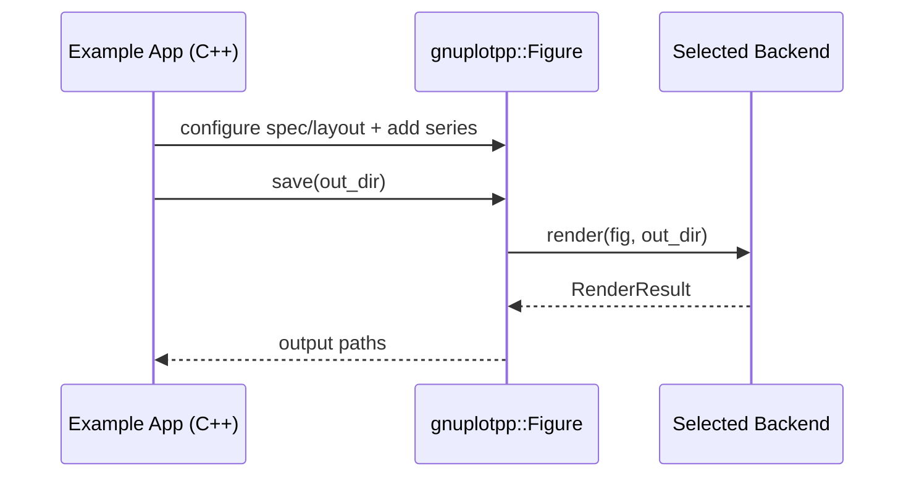

# gnuplotpp

Pure C++20 plotting API with pluggable backends for publication-ready IEEE/AIAA figures.

## Build

```bash
cmake --preset dev-debug
cmake --build --preset build-debug
ctest --preset test-debug
```

## Architecture

```mermaid
flowchart LR
  A[FigureSpec/AxesSpec/SeriesSpec] --> B[Figure/Axes Containers]
  B --> C[IPlotBackend]
  C --> D[GnuplotBackend]
  C --> E[SvgBackend]
  D --> F[tmp/*.dat]
  D --> G[tmp/figure.gp]
  D --> H[figure.pdf|svg|eps|png]
  E --> I[figure.svg]
```

## Render Flow



## CMake Presets

- `dev-debug`
- `dev-release`
- `dev-cpm`
- `build-debug`
- `build-release`
- `build-cpm`
- `test-debug`
- `test-release`

## CPM Dependencies (inside CMake)

CPM is optional via `GNUPLOTPP_ENABLE_CPM=ON`.
When enabled, CMake downloads `CPM.cmake` and resolves C++ libraries (currently `nlohmann_json`).

## Gnuplot and CPM

- CPM is best for CMake/C++ dependencies.
- `gnuplot` is an external CLI renderer.
- Recommended: install `gnuplot` with system package managers and keep CPM for C++ libs.

## No Separate Plot Command

You run only the C++ executable.

- If `gnuplot` exists, examples render publication outputs (`pdf/svg/png`) via `GnuplotBackend`.
- If `gnuplot` is missing, examples automatically fall back to native `SvgBackend` and still generate `figure.svg`.

## Example Plots

```bash
./build/dev-debug/two_window_example --out out/two_window
./build/dev-debug/layout_2x2_example --out out/layout_2x2
```

Generated outputs include at least:

- `out/<name>/figures/figure.svg`
