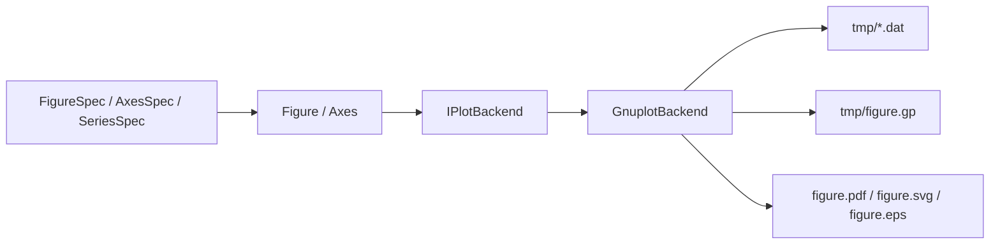

# gnuplotpp

Pure C++20 plotting API with a gnuplot renderer for figures.

## New Capability Set

- Palette/color-cycle API (`Default`, `Tab10`, `Viridis`, `Grayscale`)
- Confidence bands (`add_band`)
- Histogram, KDE, and heatmap helpers (`add_histogram`, `gaussian_kde`, `add_heatmap`)
- Rich legend controls (position, columns, box, opacity, font)
- Tick/format controls (major step, minor count, format strings)
- Text mode selection (`Enhanced`, `Plain`, `LaTeX` toggle)
- Style profiles (`Science`, `IEEE_Strict`, `AIAA_Strict`, `Presentation`, `DarkPrintSafe`)
- Typed annotations/objects (labels, arrows, rectangles)
- Reproducibility manifest export (`manifest.json`)

## Requirements

- CMake >= 3.20
- C++20 compiler
- `gnuplot` (required for final figure generation)

Install `gnuplot`:

```bash
# macOS
brew install gnuplot

# Ubuntu/Debian
sudo apt-get update && sudo apt-get install -y gnuplot

# Fedora
sudo dnf install -y gnuplot
```

## Build

```bash
cmake --preset dev-debug
cmake --build --preset build-debug
ctest --preset test-debug
```

## Architecture



## Publication Workflow

1. Configure a publication preset (`IEEE_SingleColumn`, `IEEE_DoubleColumn`, `AIAA_Column`, `AIAA_Page`).
2. Set output formats to vector (`Pdf`, `Svg`, optional `Eps`).
3. Render via `GnuplotBackend` from your C++ executable.
4. Use PDF as primary submission asset.

## Publication Defaults in Renderer

- Cairo terminals with enhanced text
- Explicit line widths and rounded joins
- Tick formatting and outward tics
- Grid styling suitable for print
- Escaped plot labels/titles for robust script generation

### Strict IEEE Mode

When using `IEEE_SingleColumn` or `IEEE_DoubleColumn`, renderer behavior is tightened to print-safe defaults:

- 8.5 pt Times-style text defaults
- monochrome plotting by default (`set monochrome`)
- dashed line-style differentiation per series (`dt 1..N`)
- per-series color/opacity overrides disable global monochrome automatically
- SciencePlots-like axis defaults: visible minor ticks, thin 0.5 axis/grid strokes
- vector-first outputs (`PDF`, `SVG`, `EPS`)

## Examples

```bash
./build/dev-debug/two_window_example --out out/two_window
./build/dev-debug/layout_2x2_example --out out/layout_2x2
./build/dev-debug/three_line_ieee_example --out out/three_line_ieee
./build/dev-debug/monte_carlo_alpha_example --out out/monte_carlo_alpha
./build/dev-debug/feature_rich_showcase --out out/feature_rich_showcase
```

### Annotated IEEE Example

Generated from:

```bash
./build/dev-debug/three_line_ieee_example --out out/three_line_ieee_readme
```


Expected outputs:

- `out/<name>/figures/figure.pdf`
- `out/<name>/figures/figure.svg`
- `out/<name>/figures/figure.eps`
- `out/<name>/figures/tmp/figure.gp`
- `out/<name>/figures/tmp/ax*_series*.dat`

Detailed controls and recipes: [Plot Controls](docs/PLOT_CONTROLS.md)

## Error Handling

`RenderResult.status` values:
- `Success`
- `InvalidInput`
- `IoError`
- `ExternalToolMissing`
- `ExternalToolFailure`
- `UnsupportedFormat`
